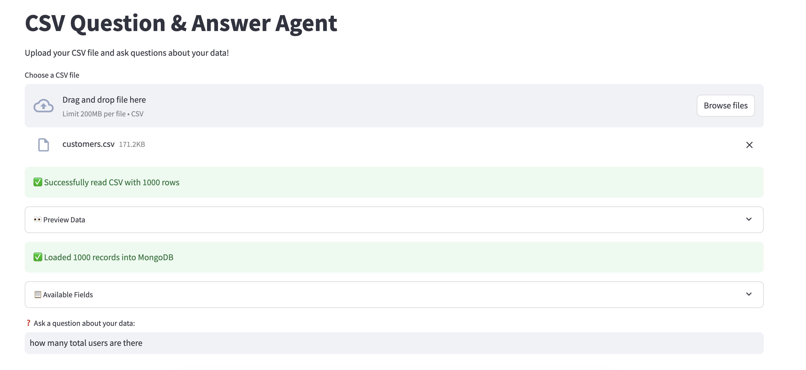
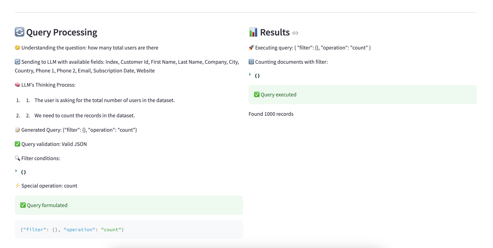
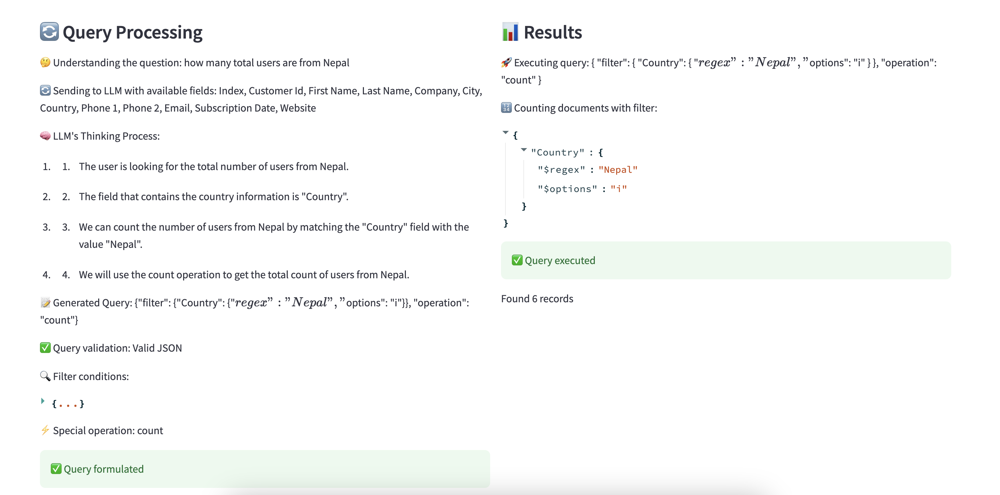
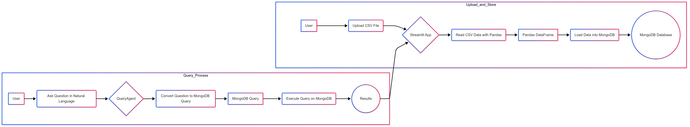

# CSV Question & Answer Agent

This project provides a Streamlit-based agent that allows users to upload a CSV file and ask questions about the data using natural language. The agent converts these questions into MongoDB queries, executes them, and displays the results.

## Features

*   **CSV Upload:** Upload CSV files directly through the Streamlit interface.
*   **Data Preview:** Preview the first few rows of the uploaded CSV data.
*   **MongoDB Integration:** Loads the CSV data into a MongoDB database for querying.
*   **Natural Language Queries:** Ask questions about the data using natural language.
*   **Query Processing:** Converts natural language questions into MongoDB queries using a language model.
*   **Results Display:** Displays the results of the executed queries in a user-friendly format.

## Dependencies

*   streamlit
*   pandas
*   pymongo
*   langchain\_openai
*   langchain\_core

## Setup Instructions

1.  **Install Dependencies:**

    ```bash
    pip install streamlit pandas pymongo langchain_openai langchain_core
    ```

2.  **Install MongoDB:**

    Ensure MongoDB is installed and running locally. You can download it from the official MongoDB website.

3.  **Environment Configuration:**

    Make sure you have an OPENAI API key set as an environment variable.

## Usage Instructions

1.  **Run the Streamlit App:**

    ```bash
    streamlit run app.py
    ```

2.  **Upload CSV File:**

    Use the file uploader in the app to upload your CSV file.

3.  **Ask Questions:**

    Enter your questions in the text input field and press Enter. The agent will process your question and display the results.

## Screenshots

Here are some screenshots of the application:

### CSV Agent Interface

This is how the CSV Agent looks when you run the application.

### Query Processing Example 1

This is an example of how a query is processed.

### Query Processing Example 2

This is another example of how a query is processed, showing different query types and results.

## Example Questions

*   "What are the names of all customers in California?"
*   "What is the average age of the users?"

## Flow Diagram (Mermaid.js)


## Code Process Explanation

1.  The Streamlit app starts by allowing the user to upload a CSV file.
2.  Once the file is uploaded, the data is read using Pandas and displayed in a preview.
3.  The data is then loaded into a MongoDB database running locally.
4.  The app initializes a QueryAgent with the available fields from the CSV.
5.  The user can then ask questions about the data in natural language.
6.  The QueryAgent converts the natural language question into a MongoDB query using a language model.
7.  The query is executed against the MongoDB database, and the results are displayed.

## MongoDB Cloud Configuration

To use MongoDB Cloud instead of a local instance:

1.  Replace the local MongoDB connection string (`mongodb://localhost:27017`) in `app.py` with your MongoDB Cloud connection string.
2.  Ensure your MongoDB Cloud cluster is properly configured with the necessary permissions.

## OpenAI API Key Configuration

The OpenAI API key should be set as an environment variable named `OPENAI_API_KEY`. The format is a string of characters. For example:

```
OPENAI_API_KEY=sk-xxxxxxxxxxxxxxxxxxxxxxxxxxxxxxxxxxxxxxxxxxxxxxxx
```

## Notes

*   Ensure MongoDB is running on the default port (27017) or configure the connection string accordingly.
*   The agent uses the "csvAgent" database and the "csv\_data" collection.
*   The OpenAI API key must be set as an environment variable.
